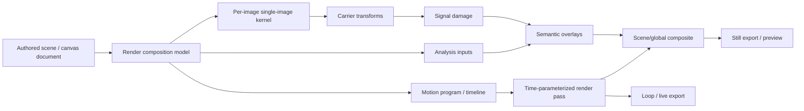

# Media Native Render Pipeline

- Baseline: `single-image kernel complete; canvas/editor render-backed image paths share one canonical runtime; scene/global and motion-oriented styling are still outside the main pipeline`
- Scope: evolve the current single-image render pipeline into a media-native pipeline that supports carrier transforms, signal damage, semantic overlays, analysis-driven layers, and short motion / live export without regressing the existing single-image kernel

## Why This Exists

- The current pipeline is structurally strong for single-image rendering, but its product vocabulary is still mostly framed as image adjustments plus staged raster effects.
- The target product direction is not camera-filter realism. It is screen-native, transmission-native, interface-native, and machine-vision-native media styling.
- That direction needs first-class support for:
  - carrier replacement (`textmode`, dither, halftone, fixed palette, UI-native composition)
  - signal artifacts (`pixel sort`, row/column shift, channel drift, compression/scan damage)
  - semantic overlays (`caption`, `HUD`, browser chrome, comments, stickers, logs, timestamp)
  - analysis layers (segmentation, landmarks, OCR/detection boxes, tracking)
  - short motion / loop rendering for live-photo-like output

## Decisions

- Do not reopen `single-image-render-kernel` for this work. The single-image kernel remains the per-image execution primitive.
- Keep one canonical render document boundary, but extend the authored model above pure image effects.
- Split render features into explicit families instead of treating all of them as one generic effect bucket:
  - `imageEffects`
  - `carrierTransforms`
  - `signalDamage`
  - `semanticOverlays`
  - `analysisLayers`
  - `motionPrograms`
- Formalize render stage names around responsibility, not implementation-relative `after*` naming.
- Treat still image rendering and motion rendering as related but distinct contracts:
  - still: single-frame deterministic render
  - motion: time-parameterized render over one source or frame sequence
- Keep preview and export on the same conceptual pipeline, but allow quality/perf divergence at the scheduler and sampling level.
- Do not force scene/global behavior through image-node-local legacy bridges or ad hoc output hacks.

## Target Architecture

## Current Pipeline Mapping

- Already in place:
  - canonical per-image render state and document
  - one shared single-image runtime for canvas/editor render-backed paths
  - staged effect execution with stable stage snapshots
  - mask-aware effect compositing
  - explicit timestamp/output-stage handling
- Missing or under-modeled:
  - first-class semantic overlay layer system
  - first-class carrier transform family
  - first-class signal-damage family
  - formal analysis input boundary
  - motion/time contract above single-frame rendering
  - production-grade stage naming and composition terminology

## Proposed Stage Model

- `source`
  - asset decode, crop/orientation, source normalization
- `develop`
  - tone/color/detail correction on the base image
- `carrier`
  - replace or reinterpret the image carrier (`ASCII`, palette, halftone, textmode, pixel grid)
- `style`
  - apply film/signal/system-native stylization that depends on the current carrier
- `overlay`
  - captions, HUD, browser chrome, comments, stickers, system metadata, OCR/detection boxes
- `composite`
  - scene/global composition and multi-layer board assembly
- `finalize`
  - export-specific finishing, timestamp variants, framing, loop packaging

## Slices

### 1. Formalize Stage Vocabulary

- Replace legacy placement naming with explicit responsibility-based stages:
  - `develop`
  - `style`
  - `finalize`
- Keep runtime behavior equivalent in this slice; this is a naming and contract hardening pass, not a visual change pass.
- Validation:
  - render snapshot plan tests still pass
  - no preview/export behavior drift for existing single-image effects

### 2. Add Semantic Overlay Layer System

- Promote timestamp-style output handling into a general overlay system.
- Support authored overlay items such as:
  - caption
  - HUD
  - browser chrome
  - chat/comment bubble
  - sticker
  - system log / timecode
- Decide ownership:
  - per-image overlay
  - board/global overlay
  - both, with explicit composition rules
- Validation:
  - canvas preview/export parity for overlays
  - editor render-backed export parity for overlay-bearing images

### 3. Formalize Carrier and Signal Effect Families

- Split style features into explicit families instead of generic effect placement only.
- First target families:
  - `carrierTransforms`: `ASCII`, dither, halftone, fixed-palette, textmode
  - `signalDamage`: channel drift, line displacement, row/column shift, compression artifacts, pixel sort
- Define which families are:
  - single-frame deterministic
  - analysis-dependent
  - motion-sensitive
- Validation:
  - preset examples render deterministically in still mode
  - family boundaries are reflected in authored state and docs

### 4. Add Analysis Layer Boundary

- Introduce explicit analysis inputs instead of implicit effect-local ad hoc analysis.
- Candidate inputs:
  - segmentation
  - face landmarks
  - OCR blocks
  - object boxes
  - edge/depth-like derived maps where feasible
- Analysis layers must be render inputs, not undocumented side channels.
- Validation:
  - one analysis-driven overlay preset
  - one analysis-driven carrier/signal preset

### 5. Add Motion / Live Render Contract

- Create a time-parameterized render contract above the current single-image kernel.
- Scope this to short-loop / live-card output, not full nonlinear video editing.
- Define:
  - source frame ownership
  - time parameter
  - frame-to-frame state
  - preview scheduler
  - export packaging
- Validation:
  - one still preset can be upgraded to loop output
  - one motion-native preset renders as a stable short loop

### 6. Preview / Export Quality Split

- Keep one conceptual pipeline, but separate:
  - interactive preview
  - quality preview
  - export render
- Move heavy analysis and high-cost diffusion/sampling work behind explicit quality tiers.
- Validation:
  - no second source of truth for authored state
  - preview remains responsive without changing final output semantics

## Risks

- If carrier transforms and semantic overlays are implemented as more generic `effect` nodes only, the model will stay under-specified and become harder to extend.
- If motion support is forced into the current single-frame entrypoint, timing/state concerns will leak into the still-image kernel and regress determinism.
- If scene/global styling is mixed with image-node-local state, ownership will become ambiguous and export parity will drift.
- If preview optimization creates a second document model, the current cleanup gains around canonical state will be lost.

## Validation Boundary

- Each slice must prove:
  - authored state ownership
  - stage ordering
  - preview/export parity expectations
  - narrow targeted regression coverage
- Do not claim motion support complete until:
  - short-loop preview works
  - export packaging exists
  - one end-to-end preset is validated in still and motion forms

## Execution Record

- Completed first slice:
  - hard-cut legacy effect placement naming from `afterDevelop` / `afterFilm` / `afterOutput` to `develop` / `style` / `finalize`
  - introduced a shared overlay runtime entry and routed timestamp handling through it
  - kept authored output state stable; this slice does not add a persisted `semanticOverlays` model yet
- Active follow-up slice:
  - `carrier-and-signal-families` is now in progress through an ASCII-first still-image implementation
  - added authored `carrierTransforms` while keeping `effects` for non-carrier raster/post effects only
  - legacy ASCII-in-`effects` documents normalize into in-memory `carrierTransforms`, and resave strips legacy ASCII effects back out
  - inserted an explicit `carrier` stage into the single-image outer kernel: `develop -> film-stage -> carrier -> style -> overlay -> finalize`
  - ASCII now executes as `snapshot analysis -> FeatureGrid -> GridSurface -> raster materialization`
  - `ImageProcessState` and `imageProcessing` remain raster-trunk only; no carrier logic moved into the low-level WebGL/CPU pipeline
- Explicitly not done in this slice:
  - authored overlay item schema
  - board/global overlay ownership
  - signal-damage authored family or execution path
  - analysis-layer inputs
  - motion/live contract
  - preview/export quality-tier split

## Validation

- Passed focused regression:
  - `pnpm exec vitest --run src/render/image src/features/canvas/boardImageRendering.test.ts src/features/canvas/renderCanvasDocument.test.ts src/features/editor/renderDocumentCanvas.test.ts src/features/editor/renderMaterialization.test.ts`
- Passed type validation:
  - `pnpm exec tsc -p tsconfig.json --noEmit`
- Passed live-source inventory:
  - `rg -n "\bafterDevelop\b|\bafterFilm\b|\bafterOutput\b" src`
  - no matches

## Handoff

- Start with Slice 1 plus a concrete overlay prototype, not the whole roadmap at once.
- The first implementation slice should avoid new media codecs or browser-worker architecture changes unless they are required for the chosen prototype.
- This task is the concrete planning follow-up for `scene-global-render-follow-up`, not a replacement for the current single-image kernel.
- Implemented in the first slice:
  - canonical stage naming is now `develop -> style -> overlay -> finalize`
  - timestamp handling now flows through a shared overlay runtime entry instead of direct per-call special casing
- Implemented in the current ASCII-first carrier sub-slice:
  - `CanvasImageRenderStateV1` now carries `carrierTransforms`
  - ASCII authoring/editing moved out of `effects[]` and into `carrierTransforms`
  - preview/export revision identity now includes carrier transforms
  - legacy ASCII effect persistence is treated as read-only compatibility input, not a write-path schema
- Still open after the first slice:
  - authored `semanticOverlays` model
  - board/global overlay ownership rules
  - non-timestamp overlay types
  - signal-damage families
  - carrier families beyond ASCII (`dither`, `halftone`, `palette`, `textmode`)
  - motion/live render contract
