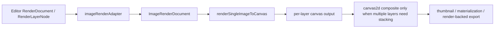

# Single Image Render Kernel

- Baseline: `canvas image node(renderState) -> ImageRenderDocument -> renderSingleImageToCanvas -> imageProcessing(state) -> preview/export`
- Scope: finish the single-image cutover so runtime rendering consumes canonical single-image state end-to-end, legacy runtime bridges are removed, and canvas/editor render-backed entries share the same kernel path

## Decisions

- `src/render/image` remains the canonical single-image boundary.
- Canvas image nodes persist canonical `renderState` only. Legacy top-level `adjustments` / `filmProfileId` are no longer part of the supported persisted image-node shape.
- `CanvasWorkbenchSnapshot.version` is `5`. Persisted snapshot loading is strict for this version; old canvas snapshot compatibility is intentionally retired instead of keeping a dual runtime path.
- New node creation still snapshots asset defaults once, but the ingress helper is now named by responsibility instead of `legacy*` semantics:
  - `createCanvasImageRenderStateFromAsset(...)`
  - `createAssetImageRenderDocument(...)`
- `renderSingleImageToCanvas(...)` still owns single-image stage ordering:
  - `develop-base`
  - `develop`
  - `film-stage`
  - `style`
  - `overlay`
  - `finalize`
- Runtime low-level rendering now consumes canonical process state directly:
  - `geometry`
  - `develop`
  - `masks`
  - `film`
- ASCII, `filter2d`, and timestamp remain explicit outer-kernel stages. They are no longer hidden compatibility branches inside `imageProcessing`.
- Runtime film resolution and low-level uniform resolution now consume canonical sub-state directly. Legacy adjustment-shaped helpers remain only for non-runtime tools that still need them.
- Board/global stylization and scene-level effect graph work are out of scope for this task and are tracked separately in `docs/tasks/scene-global-render-follow-up.md`.

## Architecture

## Files

- `src/render/image/types.ts`
  - Defines the canonical single-image contract and the low-level runtime view `ImageProcessState`.
  - `extractImageProcessState(...)` is now the only runtime projection step between the authored document and `imageProcessing`.
- `src/render/image/renderSingleImage.ts`
  - Canonical single-image runtime entry.
  - Buckets effect nodes by placement, snapshots stages explicitly, restores timestamp from canonical output state, and passes canonical process state to the low-level helpers.
- `src/render/image/stateCompiler.ts`
  - Still owns canonical state construction from asset-side legacy adjustment data.
  - No longer compiles runtime requests back into legacy low-level settings.
- `src/render/image/legacyAdapter.ts`
  - Asset/document ingress only.
  - Builds canonical `ImageRenderDocument` instances from asset-side adjustment inputs without advertising runtime `legacy*` semantics.
- `src/lib/imageProcessing.ts`
  - Low-level runtime entry now accepts `state: ImageProcessState`.
  - Geometry, main tone/color/detail passes, local region deltas, render keys, tile keys, dirty keys, and film resolution all read canonical state directly.
  - Output-stage compatibility branches for ASCII/timestamp are removed.
- `src/lib/renderer/uniformResolvers.ts`
  - Runtime resolvers now have canonical sub-state entry points for master, HSL, point-curve, and detail uniforms.
  - The legacy runtime curve bridge is removed from the canonical path.
- `src/lib/film/renderProfile.ts`
  - Runtime film/profile resolution now has a canonical state entry point used by `imageProcessing`.
  - Legacy adjustment-based resolution remains only as a non-runtime boundary.
- `src/features/canvas/boardImageRendering.ts`
  - Canvas preview entry. Resolves canonical image state, builds `ImageRenderDocument`, and routes into the single-image kernel.
- `src/features/canvas/renderCanvasDocument.ts`
  - Canvas export entry. Uses the same single-image runtime for each image element before board-level compositing.
- `src/features/editor/imageRenderAdapter.ts`
  - Editor-to-kernel adapter. Converts editor document/layer inputs into canonical `ImageRenderDocument` objects.
- `src/features/editor/renderDocumentCanvas.ts`
  - Render-backed editor export/materialization/thumbnail entry.
  - Direct renders and per-layer renders now share the same single-image kernel.
- `src/features/canvas/document/migration.ts`
  - Persisted canvas snapshot ingress is now strict about version `5`.
  - Old persisted canvas snapshot migrations were removed instead of being silently maintained.
- `src/features/canvas/imageRenderState.ts`
  - Canvas image mutation/preview resolution is strict about canonical `renderState`.
  - Missing `renderState` now fails closed instead of fabricating defaults from the asset at mutation time.
- `src/types/canvas.ts`
  - Persisted image nodes now carry canonical `renderState` as the supported shape.

## Execution Record

- Completed: runtime rendering no longer compiles canonical single-image state back into `EditingAdjustments` before entering `imageProcessing`.
- Completed: `imageProcessing` public runtime options now accept canonical `state` instead of runtime `adjustments` / `filmProfile`.
- Completed: low-level runtime keys, local-region execution, geometry transforms, film resolution, and pass uniforms now read canonical state directly.
- Completed: runtime ASCII/timestamp compatibility branches were removed from `imageProcessing`; these stages now live only in the explicit single-image kernel.
- Completed: editor render-backed export/materialization/thumbnail remain on the shared single-image kernel path.
- Completed: canvas persisted image-node compatibility fields and persisted legacy snapshot migration branches were removed.
- Completed: runtime bridge symbols are gone from live source search:
  - `compileImageRenderDocumentToProcessSettings`
  - `compileCanvasImageRenderStateToLegacyAdjustments`
  - low-level runtime calls that pass `adjustments`

## Validation

- Passed canonical runtime regression:
  - `pnpm exec vitest --run src/render/image src/features/canvas src/features/editor`
- Passed type validation:
  - `pnpm exec tsc -p tsconfig.json --noEmit`
- Passed runtime bridge inventory:
  - `rg -n "compileImageRenderDocumentToProcessSettings|compileCanvasImageRenderStateToLegacyAdjustments|renderImageToCanvas\\([^\\)]*adjustments|renderFilmStageToCanvas\\([^\\)]*adjustments|renderDevelopBaseToCanvas\\([^\\)]*adjustments" src`
  - no matches

## Status

- Scoped target: done.
- `legacy-pipeline-retirement-readiness`: done.
- `low-level-settings-cutover`: done.
- `scene-level-follow-up`: moved out of this task and tracked separately.

## Handoff

- Treat the single-image runtime migration as complete for its scoped target.
- Do not reopen this task to add board/global or scene-level stylization. Use `docs/tasks/scene-global-render-follow-up.md` instead.
- Legacy adjustment-shaped helpers that remain outside runtime should be handled as independent boundary cleanup, not as proof that the runtime cutover is incomplete.
